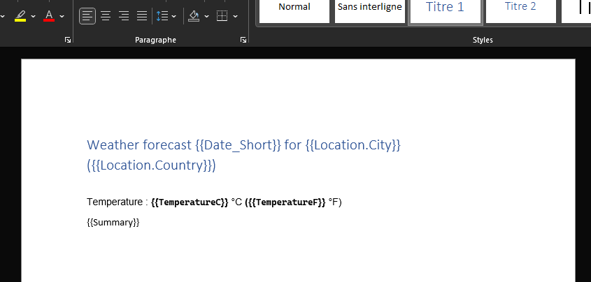

# OpenXmlBinder

OpenXmlBinder is a simple binder for Word OpenXml file. It allows easy filling of word template from C# object in the style of [ClosedXml.Reports](https://github.com/ClosedXML/ClosedXML.Report).

OpenXmlBinder targets .net6 and uses [Open-XML-SDK](https://github.com/OfficeDev/Open-XML-SDK) and [Open-XML-PowerTools](https://github.com/OfficeDev/Open-Xml-PowerTools) 

## Installing OpenXmlBinder from nuget

OpenXmlBinder can be installed from the nuget packge manager or from the console :

```
PM> Install-Package OpenXmlBinder
```

## Usage

OpenXmlBinder is pretty straightforward to use. 

1. Instantiate a OpenXmlBinder with the path to the word template
2. Use the method binderInstance.AddVariable() to bind any variables
3. Call binderInstance.Generate() to get a byte array from the template


## AddVariable method

Calling `AddVariable(string name, string value)` allows creation of named variables.

You can also directly call `AddVariable(object obj)`. Each public property (including nested) of the `obj` will be parsed.

## Complete example

### Word document template



### Code 

```
OpenXmlBinder binder = new OpenXmlBinder("Template/WeatherForecastTemplate.docx");

WeatherForecast forecast = new WeatherForecast
{
    Date = DateTime.Now,
    TemperatureC = Random.Shared.Next(-20, 55),
    Summary = Summaries[Random.Shared.Next(Summaries.Length)],
    Location=new Location("Paris","France")
}

// Binding full object
binder.AddVariable(forecast);

// Adding named variable
binder.AddVariable("Date_Short",DateTime.Now.ToString("d"));

byte[] package = binder.Generate();

// Do whatever you need with the result
return File(package, "application/vnd.openxmlformats-officedocument.wordprocessingml.document", "WeatherForecast.docx");
```
